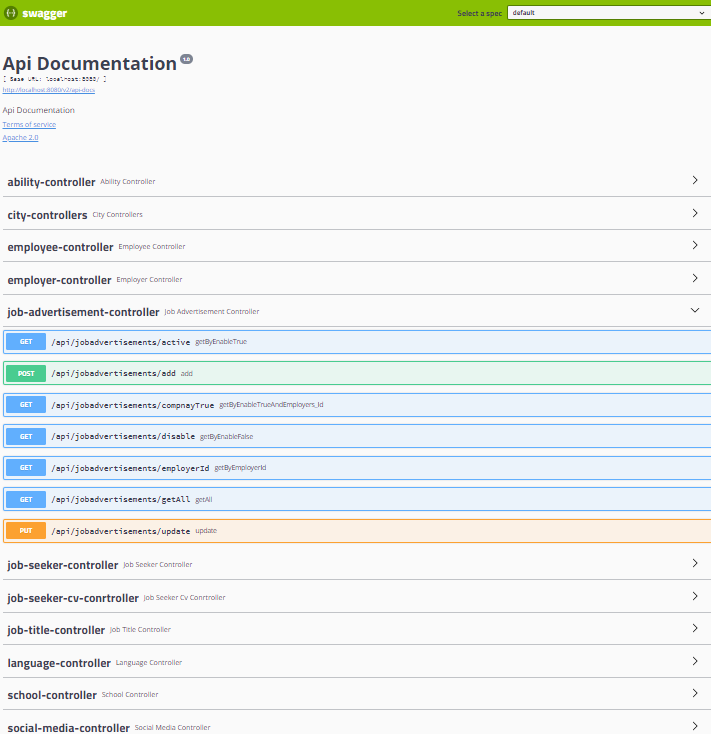

  # Human Resource Management System - Backend

---
## `File Structure` 

### `🏗️` Layered Architecture
  
* [Entities](https://github.com/TarikKaanKoc/HRMS-Backend/tree/master/src/main/java/com/koc/hrms/entities/concretes) - The package in which the assets are kept
* [DataAcces](https://github.com/TarikKaanKoc/HRMS-Backend/tree/master/src/main/java/com/koc/hrms/dataaccess/abstracts) - Package containing database related operations
* [Business](https://github.com/TarikKaanKoc/HRMS-Backend/tree/master/src/main/java/com/koc/hrms/business) - Package with business rules
* [Core](https://github.com/TarikKaanKoc/HRMS-Backend/tree/master/src/main/java/com/koc/hrms/core/utilities) - Common layer of the project
* [API](https://github.com/TarikKaanKoc/HRMS-Backend/tree/master/src/main/java/com/koc/hrms/api/controllers) - The package that connects with the user

---
  
  ## `Language and tools` 

  
<a href="https://www.postgresql.org/" target="_blank">  
<a href="https://cloudinary.com/" target="_blank">  
<a href="https://projectlombok.org/" target="_blank">  
<a href="https://hibernate.org/" target="_blank">  
<a href="https://swagger.io/" target="_blank">  

  
---
 
## `Backend Requests`

## *`🛠️ Req 1 :`  Job Seekers must be able to register in the system.*

`📌`	During registration, the user is asked for name, surname, Identity number, year of birth, e-mail, password, password repeat information.
 
`📌`	All fields are required. (The user is informed.)
 
`📌`	Mernis verification is done and the system is registered. ( Simulation ) 
 
`📌`	If validation fails, the user is notified.
 
`📌`	If there is a previously registered e-mail or Identity number, the registration will not take place. (The user is informed.)
 
`📌`	Email verification is required for registration to take place.

---

## *`🛠️ Req 2 :`  Employers must be able to register in the system.*

`📌` During registration, the user is asked for company name, website, e-mail address with the same domain as the website, phone number, new account password, password repetition information. The purpose here is to prevent non-companies from joining the system.
 
`📌` All fields are required. (The user is informed.)
 
`📌` Company records are verified in two ways. 1.) Email verification is required for registration to take place. 2.) Approval from HRMS staff (our approval :)) is required.
 
`📌` If there is a previously registered e-mail, the registration will not take place. (The user is informed.)

---

## *`🛠️ Req 3 :` General job position names should be added to the system. (For example: Software Developer, Software Architect.)*

`📌` These positions cannot be repeated. (The user is warned.)

---

## *`🛠️ Req 4 :` Employers should be able to be listed. (Whole list only)*

---

## *`🛠️ Req 5 :` Job seeker should be able to be listed. (Whole list only)*

---

## *`🛠️ Req 6 :` Job positions should be able to be listed. (Whole list only)*

---

## *`🛠️ Req 7 :` Employers should be able to add job postings to the system.*

 # `📄` In the job posting form;
 
`📌` General job position can be selected from the dropdown list. (For example: Java Developer) (Required)
 
`📌` Job description entry should be possible. (For example; For our company, he is proficient in languages such as JAVA, C #, etc....) (Required)
 
`📌` City information should be able to be selected from the drop-down list. (Compulsory)
 
`📌` It should be possible to enter min-max for the salary scale. (Optional)
 
`📌` The number of open positions must be entered. (Compulsory)
 
`📌` Finish the application deadline must be entered.

---

## *`🛠️ Req 8 :` All active job postings in the system should be listed.*

`📌` The list should come in tabular form.
 
`📌` Company name, general job position name, number of open positions, publication date, nish the application deadline must be entered

---

## *`🛠️ Req 9 :` All active job postings of a company should be listed in the system by date.*

`📌` The list should come in tabular form.
 
`📌` Company name, general job position name, number of open positions, publication date, nish the application deadline must be entered

---

## *`🛠️ Req 10 :` All active job postings of a company should be listed in the system.*

`📌` The list should come in tabular form.
 
`📌` Company name, general job position name, number of open positions, publication date, nish the application deadline must be entered

---

## *`🛠️ Req 11 :` Employers should be able to close a posting in the system. (Passive posting)*

---

## *`🛠️ Req 12 :` Job seekers should be able to enter their CV into the system.*

`📌` Job seekers should be able to add their schools to the system. (School name, department)
 
`📌` These schools should be able to enter the years they studied in the system.
`📌` If she does not graduate, the graduation year can be blank.
 
`📌` Job seekers should be able to sort the schools in reverse order according to their graduation year. ( for example : If not graduated, this school should be displayed at the top and as "in progress".)
 
`📌` Job seekers should be able to enter their work experience. (Business name, position) 
 
`📌` Job seekers hey should be able to enter into the system in which years they have done this experience. 
 
`📌` If she is still working, the year of leaving should be blank.
 
`📌` Job seekers' experience should be in reverse order by year. ( for example:  If it's still running, this experience should still be displayed at the top and "in progress".)
 
`📌` Job seekeres should be able to enter the foreign languages they know into the system. ( Language, Level -> 1-5)
 
`📌` Job seekers should be able to enter photos into the system. The photo of the candidate will be kept in the https://cloudinary.com/pricing system. (External service integration) Use the free account.
 
`📌` Job seekers should be able to enter github and linkedin addresses into the system.
 
`📌` Job seekeres should be able to enter the programming languages or technologies they know into the system. (Programming/Technology name) (For example; Js, React, html, css)
 
`📌` Job seekers should be able to add a cover letter to the system. (For example: I like working very much....)

---

### `ER Diagram with PostgreSQL`
### <a href="Database.sql">Click</a> for script codes.

  
---

### `Screenshot from swagger`    

 

---

### `Resources benefited from while developing this project`

- [Baeldung](https://www.baeldung.com)
- [Validation](https://www.baeldung.com/javax-validation)
- [Jpa Entities](https://www.baeldung.com/jpa-entities)
- [List of Rules](https://www.baeldung.com/java-rule-engines)
- [Spring Data Jpa](https://docs.spring.io/spring-data/jpa/docs/current/reference/html/#repositories)
- [Microservice architecture](https://gokhana.medium.com/microservice-mimarisi-nedir-microservice-mimarisine-giri%C5%9F-948e30cf65b1)
- Derived Query Methods in Spring Data JPA Repositories [Derived Query Methods](https://www.baeldung.com/spring-data-derived-queries)
- @Request Param Annotation [Spring @RequestParam Annotation](https://www.baeldung.com/spring-request-param)
- [Spring Cache](https://www.baeldung.com/spring-cache-tutorial)
- [Spring Framework ecosystem](https://medium.com/huawei-developers-tr/2-spring-nedir-spring-boot-ve-spring-framework-neden-kullanılır-2cccb8f3a4fa)
- H[Hibernatte Inheritance Mapping](https://www.baeldung.com/hibernate-inheritance)
- [ModelMapper](https://www.baeldung.com/java-modelmapper-lists)
